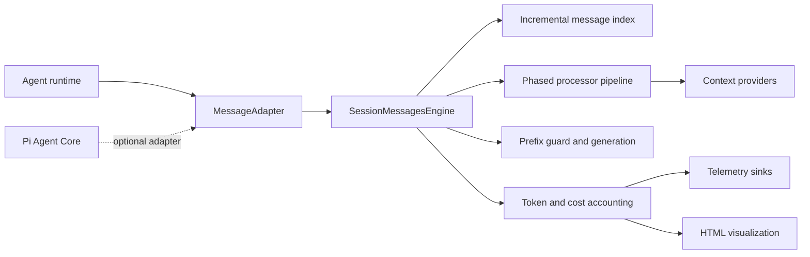

# Message Engine

[](https://github.com/Innei/message-engine/actions/workflows/ci.yml)
[](https://www.npmjs.com/package/@innei/message-engine)
[](./LICENSE)

`@innei/message-engine` is an adapter-driven message pipeline for stateful AI agents. It preserves append-only conversation prefixes, incrementally maintains message indexes, supports a phased LobeChat-style context pipeline, and attributes tokens, cache usage, and cost to individual context sources.

The core package does not depend on a particular agent runtime. Pi Agent Core is provided through the optional `@innei/message-engine/adapters/pi` entry point.

## Features

- Runtime-agnostic `MessageAdapter` — bring your own message type
- Append-only prefix guard with strict blocking or generation invalidation
- Incremental message indexes without rescanning the committed prefix
- Phased processor pipeline with session-cached contributions
- Opt-in token, cache, and cost attribution per source / module / processor
- Standalone HTML telemetry reports and a complete React trace inspector
- Optional Pi Agent Core adapter with system-prompt and OpenRouter prompt-cache bridges

## Installation

```bash
pnpm add @innei/message-engine
```

For the Pi adapter:

```bash
pnpm add @innei/message-engine @earendil-works/pi-agent-core @earendil-works/pi-ai
```

Requires Node.js 22 or later.

## Architecture



One engine instance owns one session. Its transcript, stable contribution cache, indexes, token-count cache, telemetry state, and prefix generation therefore share a single lifecycle.

## Quick start

Define the message contract once at the application boundary:

```ts
import { SessionMessagesEngine, fingerprint, type MessageAdapter } from '@innei/message-engine';

interface AppMessage {
  content: string;
  role: 'assistant' | 'user';
  timestamp: number;
}

const adapter: MessageAdapter<AppMessage> = {
  id: 'app-message/v1',
  clone: (message) => structuredClone(message),
  fingerprint,
  getRole: (message) => message.role,
  getTextSegments: (message) => [{ content: message.content, sourceType: message.role }],
  createUserMessage: (content, timestamp = Date.now()) => ({
    content,
    role: 'user',
    timestamp,
  }),
  appendTextToUserMessage: (message, content) => ({
    ...message,
    content: `${message.content}\n\n${content}`,
  }),
};

const engine = new SessionMessagesEngine({
  adapter,
  initial: { agentId: 'market-agent' },
  services: { portfolio: portfolioService },
  sessionId: 'session-42',
  strict: true,
});

engine.append([{ content: 'Analyze this market.', role: 'user', timestamp: Date.now() }]);

const result = await engine.compileTurn({
  step: { iteration: 1 },
  turnId: 'turn-1',
});

await engine.destroy();
```

An adapter is responsible for cloning, stable fingerprinting, role lookup, textual token segments, and user-message construction. Tool-call lookup is optional. Messages should be treated as immutable after ingestion.

## Pipeline model

Processors execute in a fixed phase order. `before` and `after` constraints provide deterministic ordering inside a phase.

| Phase               | Intended responsibility                     |
| ------------------- | ------------------------------------------- |
| `sanitize`          | Remove invalid or runtime-only artifacts    |
| `history`           | Summarize, prune, or transform history      |
| `system`            | Compose system instructions                 |
| `stable-context`    | Insert cache-stable context near the prefix |
| `user-augmentation` | Enrich the latest user request              |
| `virtual-tail`      | Add transient user-tail context             |
| `transform`         | Apply general message transformations       |
| `content`           | Final content-level processing              |
| `finalize`          | Validate and finalize provider input        |

```ts
import type { MessageEngineModule } from '@innei/message-engine';

const runtimeModule: MessageEngineModule<AppMessage, Initial, Step, Services> = {
  id: 'runtime',
  processors: [
    {
      id: 'runtime.market-state',
      phase: 'virtual-tail',
      cacheScope: 'turn',
      access: { reads: ['content'], writes: 'none' },
      process(context) {
        context.contribute({
          slot: 'virtual-tail',
          content: {
            cacheScope: 'turn',
            id: 'market-state',
            sourceType: 'runtime-state',
            text: context.services.market.snapshot(),
          },
        });
      },
    },
  ],
};
```

> [!IMPORTANT]
> Session-cached processors are evaluated once and replay their attributed contributions on later turns. They must only call `contribute`. Structural mutation from a session-cached processor is rejected because it cannot be replayed safely.

The abstract providers `BaseSystemPromptProvider`, `BaseFirstUserContentProvider`, `BaseLastUserContentProvider`, and `BaseVirtualTailProvider` cover the common contribution locations while retaining the full processor API for product-specific stages.

Pinned user section: `BasePinnedUserProvider` or `contribute({ slot: 'pinned-user', content })`. The section binds to the user message current when it is first built and is replayed there on every later compile, never moved or rebuilt. With `cacheScope: 'session'` (default) that is once per engine instance. With `cacheScope: 'turn'` it is once per new user message, so each user message keeps the value it was compiled with; this is how to stamp the current time onto each user message without touching earlier ones. It is not written to `getMessages()`. If the target is already in the previous compiled prefix, the engine appends a compile-time user message instead of rewriting the committed user.

Turn-scoped `last-user` may only augment a user message appended since the previous compile; otherwise `PipelineConfigurationError`. Use `virtual-tail` for per-turn data after a tool loop. This is a behavior change for hosts that ran a turn-scoped last-user provider inside a tool loop.

Tool results: `createToolResultRewriteProcessor(rewrite)` in phase `history`. `rewrite` receives `{ index, message, toolCallId, ordinal, total }` (`ordinal` and `total` count tool results, so `total - ordinal - 1` is the distance from the newest one) and may return `undefined`, a replacement string (`adapter.replaceToolResultText`), or a message with the same `toolCallId`. Each `toolCallId` is rewritten at most once per generation; `invalidatePrefix()` starts a new generation. Not installed by default.

| Intent                                              | Mechanism                                     |
| --------------------------------------------------- | --------------------------------------------- |
| Bind once per session, never move                   | `pinned-user` + `cacheScope: 'session'`       |
| Bind once per user message, never move              | `pinned-user` + `cacheScope: 'turn'`          |
| Follow the newest user message                      | `last-user` + `cacheScope: 'session'`         |
| Latest every turn without touching old messages     | `virtual-tail`                                |
| This turn's new user only                           | `last-user` + `cacheScope: 'turn'`            |
| Replace the pinned baseline while the session lives | `invalidatePrefix()`                          |
| End the instance                                    | `destroy()`                                   |
| No tool-result rewriting                            | Do not install the rewrite processor          |
| Custom tool-result / history edits                  | Custom `history` processor + `replaceMessage` |

## Prefix integrity and scan boundaries

The preferred transcript path is event-driven:

```ts
engine.append(newMessages); // O(delta); existing messages are not scanned
```

`syncTranscript(fullList)` is available for runtimes that expose only a complete message array.

| Input mode                                             | Prefix work                             | Mutation detection                                                        |
| ------------------------------------------------------ | --------------------------------------- | ------------------------------------------------------------------------- |
| `append(delta)`                                        | `O(delta)`                              | Mutation is structurally impossible through this API                      |
| `syncTranscript(list)`                                 | `O(prefix + delta)`                     | Value-based fingerprint verification                                      |
| `syncTranscript(list, { trustMessageIdentity: true })` | `O(delta)` on the append-only fast path | Requires immutable message objects; verifies the prior boundary reference |

Strict mode rejects a changed committed prefix with `PrefixMutationError` before engine state is changed. Non-strict mode accepts the new transcript, increments `generation`, clears prefix-dependent caches, rebuilds indexes, and emits a structured warning through the logger and `onPrefixMutation` hook.

```ts
const engine = new SessionMessagesEngine({
  // ...
  strict: false,
  hooks: {
    onPrefixMutation(event) {
      telemetry.capture('agent_prefix_mutation', event);
    },
  },
});
```

Call `invalidatePrefix({ reason, processorId })` when a stable provider or pipeline dependency changes outside the transcript. Strict mode applies the same blocking policy.

## Token accounting and cost

Token accounting is opt-in. The tokenizer operates on attributed content segments, and its results are cached by tokenizer, model, framing type, and content digest.

```ts
const engine = new SessionMessagesEngine({
  // ...
  tokenAccounting: {
    tokenizer: {
      id: 'model-tokenizer/v1',
      count: (content, context, signal) => tokenizer.count(content, context.runtime),
    },
    pricing: {
      resolve: ({ provider, model }) => pricingTable.get(`${provider}/${model}`) ?? null,
    },
    sinks: [otelSink],
    retainTurns: 100,
  },
});

const result = await engine.compileTurn({
  runtime: { provider: 'anthropic', model: 'claude-example' },
  step,
  turnId: 'turn-7',
});

await engine.recordUsage('turn-7', {
  inputTokens: providerUsage.uncachedInputTokens,
  outputTokens: providerUsage.outputTokens,
  cacheReadTokens: providerUsage.cacheReadTokens,
  cacheWriteTokens: providerUsage.cacheWriteTokens,
});
```

`NormalizedUsage.inputTokens` is uncached input. Cache-read and cache-write tokens are recorded separately so provider cache-hit rate and tiered pricing are not double-counted.

Each `TurnTokenSnapshot` includes:

- characters, tokens, percentage, source type, module, and processor for each content segment;
- internal prefix reuse ratio and provider cache-read/write metrics;
- normalized provider usage and versioned cost estimates when pricing is available.

> [!WARNING]
> Raw segment text is excluded from snapshots and telemetry by default. Set `includeContent: true` only for controlled local debugging where prompt disclosure is acceptable.

Telemetry sinks receive `turn-compiled`, `usage-recorded`, and `session-summary` events. Sink failures are fail-open by default; set `strictTelemetry` when telemetry delivery must fail the operation.

## Visualization

The devtools entry point converts a session summary into a standalone linear-grid report with source composition, per-turn reuse, cache-hit rate, and cost tables. `toTelemetrySunburst(snapshot)` remains available for custom visualizations, while the packaged React inspector uses a denser source → module → segment prompt blueprint.

```ts
import { writeFile } from 'node:fs/promises';
import { renderSessionTelemetryHtml } from '@innei/message-engine/devtools';

const summary = engine.getTokenSummary();
if (summary) {
  await writeFile('message-engine-report.html', renderSessionTelemetryHtml(summary));
}
```

`toTelemetryChartData(summary)` is also exported for product-native dashboards.

### React trace inspector

`@innei/message-engine/devtools/react` provides a styled, dependency-light trace workspace for downstream applications that do not want to implement their own DevTool shell or charts. It includes:

- a searchable run rail, status bar, responsive workspace, and safe JSON export;
- a compact token-scale trace grid with one context-composition row per provider call;
- provider prefix-cache coverage, cache diagnostics, and message boundaries;
- a source → module → segment prompt blueprint and selected-segment metadata;
- a persistent inspector for overview, prompt, cache, activities, and raw telemetry;
- generic tree rows for tools, retries, rate limits, and application events;
- built-in light, dark, and system themes with optional label and color overrides.

Create one recorder for the application and one binding for each engine session. The binding exposes the telemetry sink and prefix-mutation hook expected by the engine:

```tsx
import { createMessageEngineDevtoolsRecorder } from '@innei/message-engine/devtools';
import { MessageEngineDevtools } from '@innei/message-engine/devtools/react';

const devtools = createMessageEngineDevtoolsRecorder({ maxRuns: 20 });
const trace = devtools.startRun({
  sessionId,
  title: 'Research agent',
  provider: runtime.provider,
  model: runtime.model,
});

const engine = new SessionMessagesEngine({
  // adapter, modules, and other session options...
  hooks: {
    onPrefixMutation: trace.recordPrefixMutation,
  },
  tokenAccounting: {
    tokenizer,
    sinks: [trace.telemetrySink],
  },
});

trace.recordActivity({
  kind: 'tool',
  label: 'webSearch',
  status: 'success',
  turnId,
});

export const AgentTrace = () => (
  <MessageEngineDevtools
    cachePolicy={{ minimumCacheTokens: 1024 }}
    source={devtools}
    theme="system"
  />
);
```

The component injects scoped styles and adapts through container queries, so consumers do not need Tailwind, a charting library, breakpoint props, or a separate CSS import. React remains an optional peer dependency and is only required when importing the React entry point.

## Pi Agent Core adapter

`createPiMessageEngine` binds the Pi `AgentMessage` adapter. Pass its transform into a Pi `Agent`:

```ts
import { Agent } from '@earendil-works/pi-agent-core';
import { createModels } from '@earendil-works/pi-ai';
import { anthropicProvider } from '@earendil-works/pi-ai/providers/anthropic';
import { createPiMessageEngine } from '@innei/message-engine/adapters/pi';

const models = createModels();
models.setProvider(anthropicProvider());
const model = models.getModel('anthropic', 'claude-sonnet-4-6');
if (!model) throw new Error('Model not found');

const engine = createPiMessageEngine({
  initial: {},
  services: {},
  sessionId: 'session-42',
});

const agent = new Agent({
  initialState: { model, systemPrompt: 'You are a helpful assistant.' },
  streamFn: models.streamSimple.bind(models),
  transformContext: engine.createTransformContext({
    step: { iteration: 1 },
  }),
});

await agent.prompt('Analyze this market.');
```

The returned transform follows Pi's non-throwing `transformContext` contract: failures are reported and the original message array is returned. Use `append`, `syncTranscript`, and `compileTurn` directly when strict errors must propagate to application control flow. Set `trustMessageIdentity: true` only if the Pi integration preserves immutable prefix object identities.

The Pi bridges below are optional. Use them when the runtime needs a compiled system prompt or an explicit OpenRouter cache breakpoint.

Pi snapshots its system prompt before invoking `transformContext`. When the pipeline has `system`-phase providers, capture the compiled prompt and apply it in `streamFn`:

```ts
import { createPiSystemPromptBridge } from '@innei/message-engine/adapters/pi';

const systemPromptBridge = createPiSystemPromptBridge(systemPrompt);

const agent = new Agent({
  initialState: { model, systemPrompt },
  streamFn: (requestModel, context, options) =>
    models.streamSimple(requestModel, systemPromptBridge.apply(context), options),
  transformContext: engine.createTransformContext({
    onCompiled: (result) => systemPromptBridge.capture(result),
    step: { iteration: 1 },
  }),
});
```

`createPiOpenRouterPromptCacheBridge` carries the engine's session-scoped `stable-prefix` boundary into Pi's final OpenRouter payload as an explicit `cache_control` breakpoint. Turn-scoped augmentation and ephemeral virtual tails stay outside the cached prefix instead of moving the automatic breakpoint.

```ts
import { createPiOpenRouterPromptCacheBridge } from '@innei/message-engine/adapters/pi';

const promptCacheBridge = createPiOpenRouterPromptCacheBridge();

const agent = new Agent({
  initialState: { model, systemPrompt },
  onPayload: promptCacheBridge.apply,
  streamFn: models.streamSimple.bind(models),
  transformContext: engine.createTransformContext({
    onCompiled: (result) => promptCacheBridge.capture(result),
    step: { iteration: 1 },
  }),
});
```

## Real-agent validation lab

The repository includes a browser-based demo that runs a real Pi `Agent` through OpenRouter and correlates each provider request with the engine's preflight token attribution and postflight Pi usage.

```bash
pnpm demo
```

Open `http://127.0.0.1:4173`, select an OpenRouter model, and enter a key in the runtime panel.

> [!NOTE]
> The key is stored in the current browser's `localStorage`, sent only to the local Vite middleware for the active request, and cleared from server session state when the turn settles. It is never written to repository files; clearing the field removes the browser entry. Alternatively, start the demo with `OPENROUTER_API_KEY` in the local environment and leave the browser field empty.

The lab verifies:

- streamed Pi Agent turns and persistent raw transcript state;
- session-scoped tenant policy and workspace context injected at the `system` and `stable-context` phases;
- turn-scoped route, selection, and runtime state injected at `user-augmentation` and `virtual-tail`;
- per-stage build counts, session-cache replay, model-visible placement, and attributed token cost;
- stable-prefix and virtual-tail Provider contributions;
- source-level token percentages and tokenizer accuracy labels;
- normalized uncached, cache-read, cache-write, reasoning, and output usage;
- catalog pricing versus provider-reported total cost;
- strict rejection or relaxed generation invalidation after deliberate prefix mutation;
- export of the standalone devtools HTML report.

The default `openai/gpt-5.6-luna` route uses the `o200k_base` tokenizer. Other OpenRouter families are marked as estimated because their provider tokenizer and framing can differ. Batch routes are omitted because the lab validates an interactive, multi-turn agent lifecycle.

## Lifecycle and uniqueness

`MessageEngineRegistry` enforces one active engine per session key within an application registry:

```ts
const engine = registry.acquire(sessionId, () => createEngine(sessionId));
await registry.destroy(sessionId);
```

`destroy()` aborts active compilation, emits and flushes the session summary, tears modules down in reverse registration order, and clears transcripts, indexes, and caches. Subsequent engine operations throw `EngineDestroyedError`.

## Package exports

| Import                                 | Contents                                           |
| -------------------------------------- | -------------------------------------------------- |
| `@innei/message-engine`                | Engine, adapters, pipeline types, token accounting |
| `@innei/message-engine/devtools`       | HTML report, chart data, sunburst model            |
| `@innei/message-engine/devtools/react` | Recorder-driven React trace inspector              |
| `@innei/message-engine/adapters/pi`    | `createPiMessageEngine` and OpenRouter/Pi bridges  |

## Development

```bash
pnpm install
pnpm run check
```

The package uses TypeScript, Vitest, Prettier, and tsdown. Tests focus on observable prefix, caching, accounting, adapter, and lifecycle behavior.

See [CONTRIBUTING.md](./CONTRIBUTING.md) for the development workflow and [SECURITY.md](./SECURITY.md) for private vulnerability reporting.
