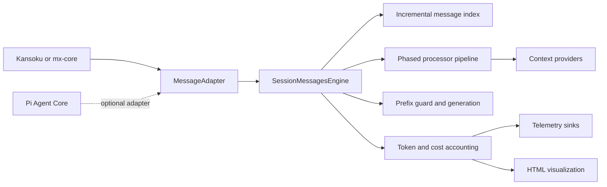

# Message Engine

[](https://github.com/Innei/message-engine/actions/workflows/ci.yml)
[](./LICENSE)

`@earendil-works/message-engine` is an adapter-driven message pipeline for stateful AI agents. It preserves append-only conversation prefixes, incrementally maintains message indexes, supports a phased LobeChat-style context pipeline, and attributes tokens, cache usage, and cost to individual context sources.

The core package does not depend on a particular agent runtime. Pi Agent Core is provided through the optional `@earendil-works/message-engine/adapters/pi` entry point.

## Installation

```bash
pnpm add @earendil-works/message-engine
```

For the Pi adapter:

```bash
pnpm add @earendil-works/message-engine @earendil-works/pi-agent-core
```

## Architecture



One engine instance owns one session. Its transcript, stable contribution cache, indexes, token-count cache, telemetry state, and prefix generation therefore share a single lifecycle.

## Quick start

Define the message contract once at the application boundary:

```ts
import {
  SessionMessagesEngine,
  fingerprint,
  type MessageAdapter,
} from '@earendil-works/message-engine';

interface AppMessage {
  content: string;
  role: 'assistant' | 'user';
  timestamp: number;
}

const adapter: MessageAdapter<AppMessage> = {
  id: 'app-message/v1',
  clone: (message) => structuredClone(message),
  fingerprint,
  getRole: (message) => message.role,
  getTextSegments: (message) => [{ content: message.content, sourceType: message.role }],
  createUserMessage: (content, timestamp = Date.now()) => ({
    content,
    role: 'user',
    timestamp,
  }),
  appendTextToUserMessage: (message, content) => ({
    ...message,
    content: `${message.content}\n\n${content}`,
  }),
};

const engine = new SessionMessagesEngine({
  adapter,
  initial: { agentId: 'market-agent' },
  services: { portfolio: portfolioService },
  sessionId: 'session-42',
  strict: true,
});

engine.append([{ content: 'Analyze this market.', role: 'user', timestamp: Date.now() }]);

const result = await engine.compileTurn({
  step: { iteration: 1 },
  turnId: 'turn-1',
});

await engine.destroy();
```

An adapter is responsible for cloning, stable fingerprinting, role lookup, textual token segments, and user-message construction. Tool-call lookup is optional. Messages should be treated as immutable after ingestion.

## Pipeline model

Processors execute in a fixed phase order. `before` and `after` constraints provide deterministic ordering inside a phase.

| Phase               | Intended responsibility                     |
| ------------------- | ------------------------------------------- |
| `sanitize`          | Remove invalid or runtime-only artifacts    |
| `history`           | Summarize, prune, or transform history      |
| `system`            | Compose system instructions                 |
| `stable-context`    | Insert cache-stable context near the prefix |
| `user-augmentation` | Enrich the latest user request              |
| `virtual-tail`      | Add transient user-tail context             |
| `transform`         | Apply general message transformations       |
| `content`           | Final content-level processing              |
| `finalize`          | Validate and finalize provider input        |

```ts
import type { MessageEngineModule } from '@earendil-works/message-engine';

const runtimeModule: MessageEngineModule<AppMessage, Initial, Step, Services> = {
  id: 'runtime',
  processors: [
    {
      id: 'runtime.market-state',
      phase: 'user-augmentation',
      cacheScope: 'turn',
      access: { reads: ['content'], writes: 'none' },
      process(context) {
        context.contribute({
          slot: 'last-user',
          content: {
            cacheScope: 'turn',
            id: 'market-state',
            sourceType: 'runtime-state',
            text: context.services.market.snapshot(),
          },
        });
      },
    },
  ],
};
```

Session-cached processors are evaluated once and replay their attributed contributions on later turns. They must only call `contribute`; structural mutation from a session-cached processor is rejected because it cannot be replayed safely.

The abstract providers `BaseSystemPromptProvider`, `BaseFirstUserContentProvider`, `BaseLastUserContentProvider`, and `BaseVirtualTailProvider` cover the common contribution locations while retaining the full processor API for product-specific stages.

## Prefix integrity and scan boundaries

The preferred transcript path is event-driven:

```ts
engine.append(newMessages); // O(delta); existing messages are not scanned
```

`syncTranscript(fullList)` is available for runtimes that expose only a complete message array.

| Input mode                                             | Prefix work                             | Mutation detection                                                        |
| ------------------------------------------------------ | --------------------------------------- | ------------------------------------------------------------------------- |
| `append(delta)`                                        | `O(delta)`                              | Mutation is structurally impossible through this API                      |
| `syncTranscript(list)`                                 | `O(prefix + delta)`                     | Value-based fingerprint verification                                      |
| `syncTranscript(list, { trustMessageIdentity: true })` | `O(delta)` on the append-only fast path | Requires immutable message objects; verifies the prior boundary reference |

Strict mode rejects a changed committed prefix with `PrefixMutationError` before engine state is changed. Non-strict mode accepts the new transcript, increments `generation`, clears prefix-dependent caches, rebuilds indexes, and emits a structured warning through the logger and `onPrefixMutation` hook.

```ts
const engine = new SessionMessagesEngine({
  // ...
  strict: false,
  hooks: {
    onPrefixMutation(event) {
      telemetry.capture('agent_prefix_mutation', event);
    },
  },
});
```

Call `invalidatePrefix({ reason, processorId })` when a stable provider or pipeline dependency changes outside the transcript. Strict mode applies the same blocking policy.

## Token accounting and cost

Token accounting is opt-in. The tokenizer operates on attributed content segments, and its results are cached by tokenizer, model, framing type, and content digest.

```ts
const engine = new SessionMessagesEngine({
  // ...
  tokenAccounting: {
    tokenizer: {
      id: 'model-tokenizer/v1',
      count: (content, context, signal) => tokenizer.count(content, context.runtime),
    },
    pricing: {
      resolve: ({ provider, model }) => pricingTable.get(`${provider}/${model}`) ?? null,
    },
    sinks: [otelSink],
    retainTurns: 100,
  },
});

const result = await engine.compileTurn({
  runtime: { provider: 'anthropic', model: 'claude-example' },
  step,
  turnId: 'turn-7',
});

await engine.recordUsage('turn-7', {
  inputTokens: providerUsage.uncachedInputTokens,
  outputTokens: providerUsage.outputTokens,
  cacheReadTokens: providerUsage.cacheReadTokens,
  cacheWriteTokens: providerUsage.cacheWriteTokens,
});
```

`NormalizedUsage.inputTokens` is uncached input. Cache-read and cache-write tokens are recorded separately so provider cache-hit rate and tiered pricing are not double-counted.

Each `TurnTokenSnapshot` includes:

- characters, tokens, percentage, source type, module, and processor for each content segment;
- internal prefix reuse ratio and provider cache-read/write metrics;
- normalized provider usage and versioned cost estimates when pricing is available.

Raw segment text is excluded from snapshots and telemetry by default. Set `includeContent: true` only for controlled local debugging where prompt disclosure is acceptable.

Telemetry sinks receive `turn-compiled`, `usage-recorded`, and `session-summary` events. Sink failures are fail-open by default; set `strictTelemetry` when telemetry delivery must fail the operation.

## Visualization

The devtools entry point converts a session summary into standalone HTML with source distribution, per-turn reuse, cache-hit rate, and cost tables. `toTelemetrySunburst(snapshot)` builds the source → module → segment hierarchy used by the live radial inspector.

```ts
import { writeFile } from 'node:fs/promises';
import { renderSessionTelemetryHtml } from '@earendil-works/message-engine/devtools';

const summary = engine.getTokenSummary();
if (summary) {
  await writeFile('message-engine-report.html', renderSessionTelemetryHtml(summary));
}
```

`toTelemetryChartData(summary)` is also exported for product-native dashboards.

## Pi Agent Core adapter

```ts
import {
  createPiMessageEngine,
  createPiOpenRouterPromptCacheBridge,
  createPiSystemPromptBridge,
  withPiOpenRouterSessionAffinity,
} from '@earendil-works/message-engine/adapters/pi';

const model = withPiOpenRouterSessionAffinity(openRouterModel);
const promptCacheBridge = createPiOpenRouterPromptCacheBridge();
const systemPromptBridge = createPiSystemPromptBridge(baseSystemPrompt);

const engine = createPiMessageEngine({
  initial,
  services,
  sessionId,
  strict: true,
  modules,
});

const transformContext = engine.createTransformContext({
  onCompiled: (result) => {
    systemPromptBridge.capture(result);
    promptCacheBridge.capture(result);
  },
  step: () => ({ iteration: currentIteration }),
  onError: reportTransformError,
});

const agent = new Agent({
  initialState: { messages: [], model, systemPrompt: baseSystemPrompt, tools: [] },
  onPayload: promptCacheBridge.apply,
  sessionId,
  transformContext,
  streamFn: (requestModel, context, options) =>
    stream(requestModel, systemPromptBridge.apply(context), options),
});
```

When using OpenRouter, pass the same stable `sessionId` to Pi's stream options on every turn.
The helper enables Pi to emit that value as `x-session-id`, which activates OpenRouter provider
stickiness from the first successful request. OpenRouter limits the value to 256 characters.

`createPiOpenRouterPromptCacheBridge` carries the engine's session-scoped `stable-prefix`
boundary into Pi's final OpenRouter payload as an explicit `cache_control` breakpoint. This is
important when a runtime also appends turn-scoped augmentation or an ephemeral virtual tail:
those dynamic blocks remain outside the cached prefix instead of moving the automatic breakpoint.

The returned transform follows Pi's non-throwing `transformContext` contract: failures are reported and the original message array is returned. Use `append`, `syncTranscript`, and `compileTurn` directly when strict errors must propagate to application control flow. Set `trustMessageIdentity: true` only if the Pi integration preserves immutable prefix object identities.

Pi snapshots its system prompt before invoking `transformContext`. When the pipeline has `system`-phase providers, use `createPiSystemPromptBridge` as above so the compiled system prompt reaches the same provider request as the transformed messages.

## Real-agent validation lab

The repository includes a browser-based demo that runs a real Pi `Agent` through OpenRouter and correlates each provider request with the engine's preflight token attribution and postflight Pi usage.

```bash
pnpm demo
```

Open `http://127.0.0.1:4173`, select an OpenRouter model, and enter a key in the runtime panel. The key is stored in the current browser's `localStorage`, sent only to the local Vite middleware for the active request, and cleared from server session state when the turn settles. It is never written to repository files; clearing the field removes the browser entry. Alternatively, start the demo with `OPENROUTER_API_KEY` in the local environment and leave the browser field empty.

The lab verifies:

- streamed Pi Agent turns and persistent raw transcript state;
- session-scoped tenant policy and workspace context injected at the `system` and `stable-context` phases;
- turn-scoped route, selection, and runtime state injected at `user-augmentation` and `virtual-tail`;
- per-stage build counts, session-cache replay, model-visible placement, and attributed token cost;
- stable-prefix and virtual-tail Provider contributions;
- source-level token percentages and tokenizer accuracy labels;
- normalized uncached, cache-read, cache-write, reasoning, and output usage;
- catalog pricing versus provider-reported total cost;
- strict rejection or relaxed generation invalidation after deliberate prefix mutation;
- export of the standalone devtools HTML report.

The default `openai/gpt-5.6-luna` route uses the `o200k_base` tokenizer. Other OpenRouter families are marked as estimated because their provider tokenizer and framing can differ. Batch routes are omitted because the lab validates interactive, multi-turn session affinity.

## Lifecycle and uniqueness

`MessageEngineRegistry` enforces one active engine per session key within an application registry:

```ts
const engine = registry.acquire(sessionId, () => createEngine(sessionId));
await registry.destroy(sessionId);
```

`destroy()` aborts active compilation, emits and flushes the session summary, tears modules down in reverse registration order, and clears transcripts, indexes, and caches. Subsequent engine operations throw `EngineDestroyedError`.

## Development

```bash
pnpm install
pnpm run check
```

The package uses TypeScript, Vitest, Prettier, and tsdown. Tests focus on observable prefix, caching, accounting, adapter, and lifecycle behavior.

See [CONTRIBUTING.md](./CONTRIBUTING.md) for the development workflow and [SECURITY.md](./SECURITY.md) for private vulnerability reporting.
